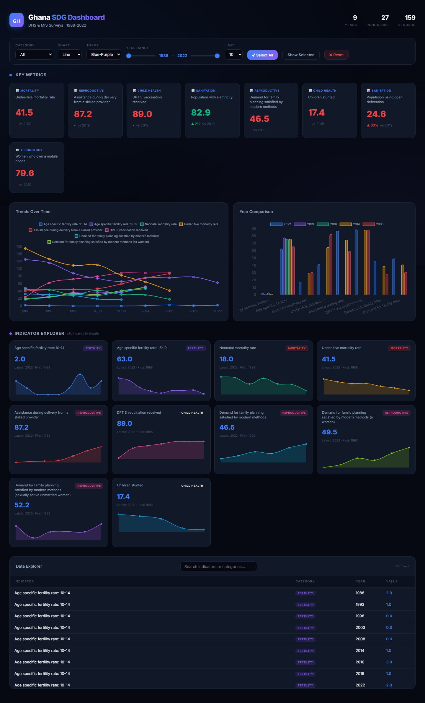

# Ghana SDG Progress Dashboard

An interactive, static HTML dashboard visualizing Ghana's Sustainable Development Goals (SDG) indicators from DHS & MIS surveys spanning **1988–2022**.



## Overview

This dashboard transforms survey data from the Demographic and Health Surveys (DHS) program into an interactive visualization platform. It tracks key health, education, infrastructure, and social indicators across multiple survey years, enabling users to identify trends, compare periods, and explore data at a granular level.

**Data Source**: DHS Program – Ghana National SDG Indicators ([sdgs_national_gha.csv](sdgs_national_gha.csv))

## Features

### Key Metrics
- **8 KPI cards** highlighting core indicators with year-over-year percentage changes
- Color-coded values: **green** for positive trends, **red** for negative
- Click any KPI card to select/deselect it across all charts

### Interactive Charts
- **Trends Over Time** – Line, bar, or radar chart showing indicator trajectories
- **Year Comparison** – Grouped bar chart comparing up to 5 survey years side-by-side
- **Indicator Explorer** – Mini sparkline charts for each indicator with first/latest year labels

### Controls
- **Category Filter** – Narrow to specific SDG areas (Fertility, Mortality, Reproductive Health, Child Health, Sanitation, etc.)
- **Chart Type** – Switch between Line, Bar, and Radar views
- **Color Themes** – 5 palettes: Blue-Purple, Neon, Warm, Ocean, Earth
- **Year Range** – Dual sliders to filter the time window
- **Indicator Limit** – Control how many indicators display at once

### Data Explorer
- Sortable table with category badges
- Real-time search filtering by indicator name or category
- Row count indicator

## Quick Start

### Option 1: Open Directly (Recommended)
Simply double-click `dashboard.html` or run:
```
start dashboard.html
```
No server or dependencies required – all data is embedded.

### Option 2: Regenerate from Source
If you modify the CSV data, rebuild the dashboard:
```bash
python build_dashboard.py
```
This reads `sdgs_national_gha.csv` and regenerates `dashboard.html` with the latest data.

## Project Structure

```
Dash/
├── sdgs_national_gha.csv    # Source data (DHS survey indicators)
├── build_dashboard.py        # Python script to generate dashboard.html
├── dashboard.html            # Interactive dashboard (open in browser)
├── dashboard.py              # Legacy Streamlit app (not needed)
├── export_data.py            # Utility to export CSV to JSON
├── data.json                 # Intermediate JSON data file
├── dashboard_data.json       # Legacy JSON data file
└── index.html                # Legacy static dashboard
```

## Indicator Categories

| Category | Indicators |
|---|---|
| **Fertility** | Age specific fertility rates (10-14, 15-19) |
| **Mortality** | Neonatal mortality rate, Under-five mortality rate |
| **Reproductive Health** | Skilled delivery assistance, Family planning satisfaction |
| **Child Health** | DPT 3 vaccination, Children stunted/wasted/overweight, Stool disposal |
| **Marriage** | Women first married by age 15 and 18 |
| **Sanitation & Infrastructure** | Electricity access, Open defecation, Basic sanitation, Clean cooking fuel, Handwashing facilities |
| **Gender & Violence** | Women's anemia, Sexual/physical/emotional violence, Decision making, Female circumcision, Tobacco use |
| **Technology** | Internet usage, Mobile phone ownership and financial transactions |

## Data Notes

- Values represent **"Total"** characteristic records (aggregated national figures)
- When multiple records exist for the same indicator and year, values are **averaged**
- Some indicators have multiple time-reference labels (e.g., "Five years preceding", "Ten years preceding") – only preferred records are used
- Survey types include **DHS** (Demographic and Health Survey) and **MIS** (Malaria Indicator Survey)

## Technologies

- **Chart.js 4.4** – Interactive charts with animations and tooltips
- **Vanilla HTML/CSS/JS** – No frameworks, no build step
- **Python 3** – Data processing and dashboard generation only
- **Inter Font** – Clean, modern typography via Google Fonts

## Browser Support

Works in all modern browsers:
- Chrome 90+
- Firefox 88+
- Safari 14+
- Edge 90+

## License

This dashboard is built from publicly available DHS Program data. Refer to the [DHS Program](https://dhsprogram.com/) for data licensing terms.
